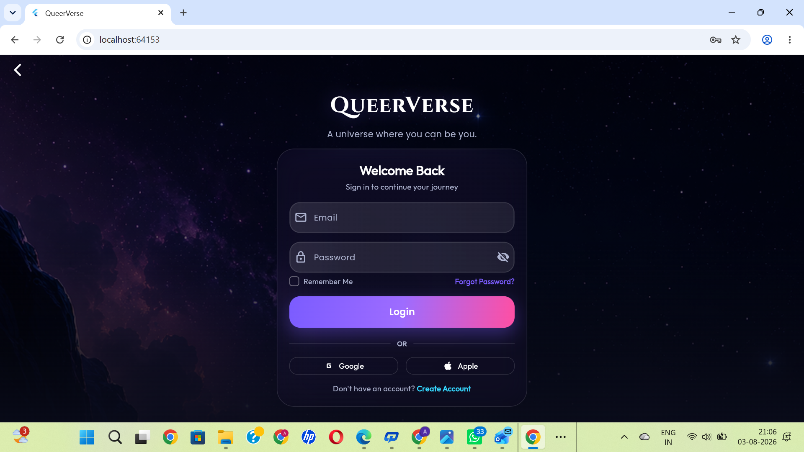
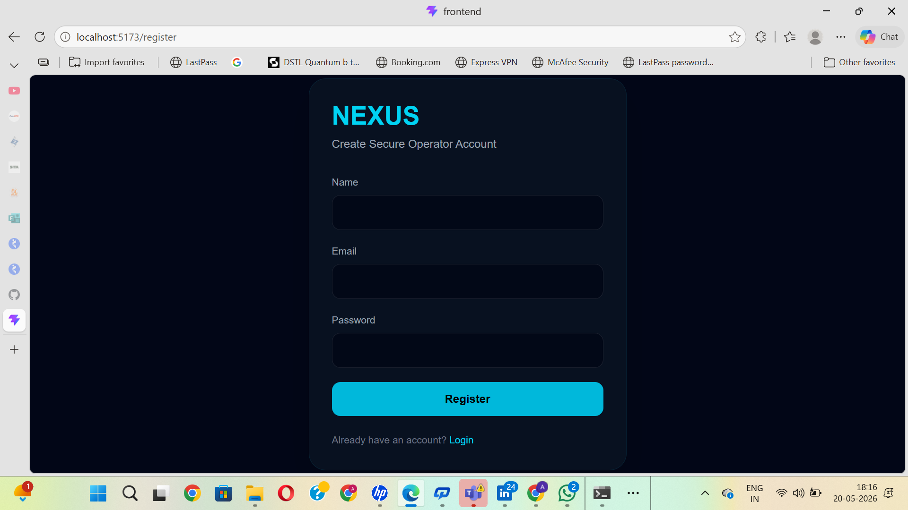
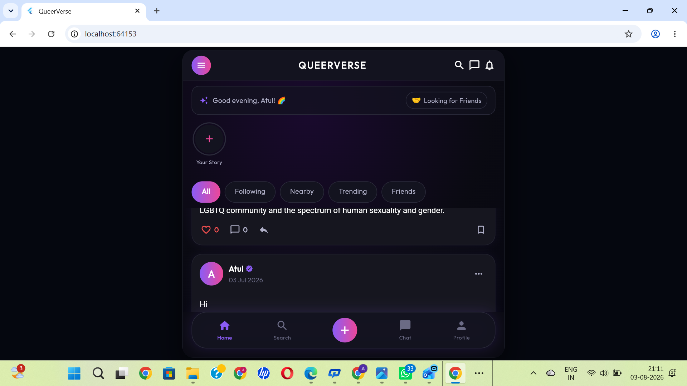
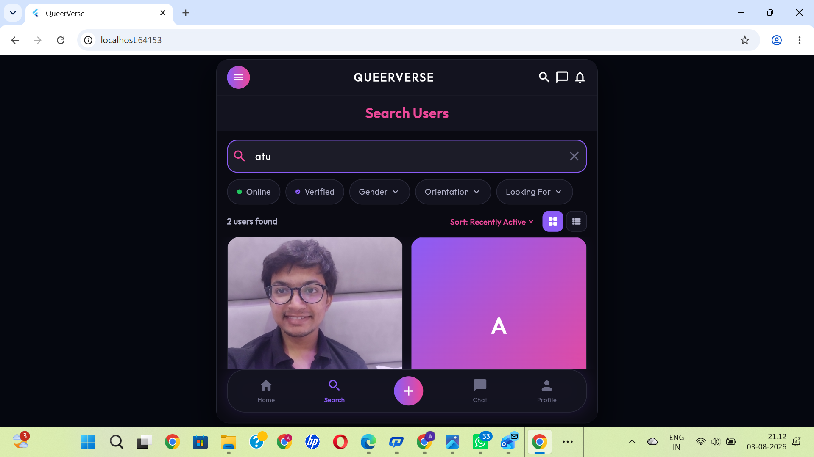
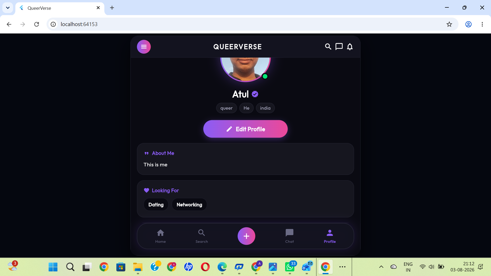

<div align="center">

# 🌈 QueerVerse

### A Modern LGBTQ+ Social Networking Platform

**Connect • Express • Discover • Build Meaningful Communities**

Built with **Flutter**, **Firebase**, and **Material Design**

<p>


</p>

### 🎥 Project Demo

👉 **[Watch Demo Video](YOUR_GOOGLE_DRIVE_LINK)**

</div>

---

# 📖 About

**QueerVerse** is a modern LGBTQ+ social networking application built using **Flutter** and **Firebase**.

The goal of the platform is to provide a safe, inclusive, and engaging digital space where people can express themselves, connect with others, discover communities, participate in events, and build meaningful relationships.

The application combines modern UI design with real-time Firebase services to deliver a responsive social networking experience across multiple platforms.

Although the project is still under active development, it already includes many production-style social networking features with a clean, scalable architecture.

---

# ✨ Features

## 🔐 Authentication

- Firebase Authentication
- Email & Password Login
- User Registration
- Secure Authentication
- Input Validation
- Error Handling
- Loading States

---

## 👤 User Profiles

Every user has a personalized profile containing:

- Profile Picture
- Display Name
- Username
- Bio
- Gender
- Orientation
- Country
- Looking For
- Verification Badge
- Followers Count
- Following Count

Users can edit and customize their profile anytime.

---

## 🏠 Home Feed

Modern social media style feed featuring:

- Community Posts
- Stories
- Personalized Feed
- Like Posts
- Comment on Posts
- Save Posts
- Share Posts

---

## ❤️ Social Features

Users can

- Like Posts
- Comment
- Save Posts
- Share Posts
- Follow Users
- Unfollow Users

All interactions are synchronized with Firebase in real time.

---

## 🔍 Search Users

Discover people using multiple filters:

- Name Search
- Online Status
- Verified Users
- Gender
- Orientation
- Looking For

---

## 📅 Events

Community event system including:

- Create Events
- Browse Events
- Join Events
- Leave Events
- Event Details
- Animated Celebration

---

## 🔔 Notifications

Real-time notification center for:

- Likes
- Comments
- Followers
- Event Updates
- Social Activities

---

## 🖼 Media Support

- Upload Profile Picture
- Upload Cover Image
- Upload Post Images

---

## 🎨 Modern UI

Designed using

- Dark Theme
- Glassmorphism
- Purple & Pink Gradient Design
- Responsive Layouts
- Smooth Animations
- Modern Typography
- Reusable Components

---

## ⚡ Performance

- Firebase Backend
- Cloud Firestore
- Cached Images
- Optimized Widgets
- Responsive Design

---

# 📸 Application Screenshots

<div align="center">

## 🔐 Login



---

## 📝 Create Account



---

## 🏠 Home Feed



---

## 🔍 Search Users



---

## 👤 User Profile



</div>

---

# 🛠 Technology Stack

| Category | Technologies |
|-----------|--------------|
| Framework | Flutter |
| Language | Dart |
| Backend | Firebase |
| Authentication | Firebase Authentication |
| Database | Cloud Firestore |
| Storage | Firebase Storage |
| State Management | Provider |
| Networking | HTTP |
| Media | Image Picker |
| Image Caching | Cached Network Image |
| Sharing | Share Plus |
| UI | Material Design, Google Fonts |
| Animations | Flutter Animate, Lottie |
| Localization | Intl |

---

# 🏗 Application Architecture

```text
                    Flutter Application
                           │
        ┌──────────────────┼──────────────────┐
        │                  │                  │
 Firebase Auth       Cloud Firestore   Firebase Storage
        │                  │                  │
        └──────────────────┼──────────────────┘
                           │
                    Firebase Backend
```

---

# 📂 Project Structure

```text
lib/
├── models/
├── providers/
├── screens/
├── services/
├── widgets/
├── utils/
├── constants/
└── main.dart

assets/
screenshots/
android/
ios/
web/
windows/
linux/
macos/
```

---

# 🚀 Getting Started

## Clone Repository

```bash
git clone https://github.com/atulsharma47/QueerVerse-App.git
```

## Navigate to Project

```bash
cd QueerVerse-App
```

## Install Dependencies

```bash
flutter pub get
```

## Run the Application

```bash
flutter run
```

### Run on Chrome

```bash
flutter run -d chrome
```

---

# 📊 Current Progress

| Module | Status |
|----------|---------|
| Authentication | ✅ Completed |
| User Profiles | ✅ Completed |
| Home Feed | ✅ Completed |
| Search Users | ✅ Completed |
| Notifications | ✅ Completed |
| Events | ✅ Completed |
| Firebase Integration | ✅ Completed |
| Responsive UI | ✅ Completed |
| Chat System | 🚧 In Development |
| Communities | 🚧 Planned |
| Voice & Video Calling | 🚧 Planned |

---

# 🌍 Platform Support

| Platform | Status |
|----------|--------|
| Android | ✅ |
| Web | ✅ |
| iOS | 🚧 Planned |
| Windows | 🚧 Planned |
| macOS | 🚧 Planned |
| Linux | 🚧 Planned |

---

# 🚀 Roadmap

### ✅ Completed

- Firebase Authentication
- User Profiles
- Home Feed
- Search Users
- Events
- Notifications
- Modern UI
- Responsive Design
- Firebase Integration

### 🚧 Upcoming

- Real-Time Chat
- Voice Calling
- Video Calling
- Communities
- Groups
- Stories
- Reels
- AI Recommendations
- Push Notifications
- Google Sign-In
- Apple Sign-In
- Premium Membership
- Admin Dashboard
- End-to-End Encryption

---

# 🎯 Project Highlights

- Modern Glassmorphism Design
- Beautiful Dark Theme
- Cross Platform Flutter Application
- Firebase Powered Backend
- Real-Time Database
- Responsive UI
- Scalable Architecture
- Community Focused Design
- Clean Code Structure

---

# 🤝 Contributing

Contributions, feature requests, bug reports, and suggestions are welcome.

If you'd like to contribute:

1. Fork the repository
2. Create a feature branch
3. Commit your changes
4. Push your branch
5. Open a Pull Request

---

# 👨‍💻 Developer

**Atul Sharma**

Computer Science Engineer

Flutter Developer

GitHub: https://github.com/atulsharma47

---

# ⭐ Support

If you found this project useful or interesting, please consider giving it a ⭐ on GitHub.

Your support helps improve the project and motivates future development.

---

<div align="center">

### 🌈 Building a safer, more inclusive digital community.

**Made with ❤️ using Flutter & Firebase**

</div>
